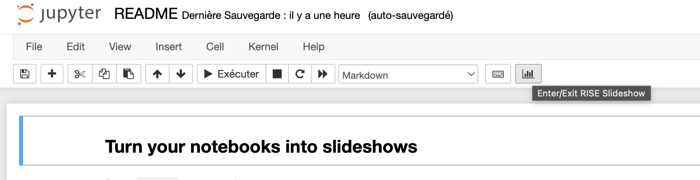

# wtf-with-rise

## Dépendances

`$>make dependencies;`

## Usage

- Lancer le notebook : `$> jupyter notebook;`
- Lancer le mode "slide" en cliquant sur le bouton suivant :
  - 

- pour faire un export html :

```shell
$> make slide-exports;
```

### pour faire un export en PDF (manuel)

<https://rise.readthedocs.io/en/stable/exportpdf.html#pdf-export> :

- Generate the slides and serve them using nbconvert:
  - jupyter nbconvert --to slides your_talk.ipynb --post serve
- Add `?print-pdf` to the query string
  - eg, <http://127.0.0.1:8000/your_talk.slides.html?print-pdf>
- Open the in-browser print dialog (Cmd/Ctrl + P).
- Change the Destination setting to Save as PDF.
- Change the Layout to Landscape.
- Change the Margins to None.
- Enable the Background graphics option.
- Click Save.